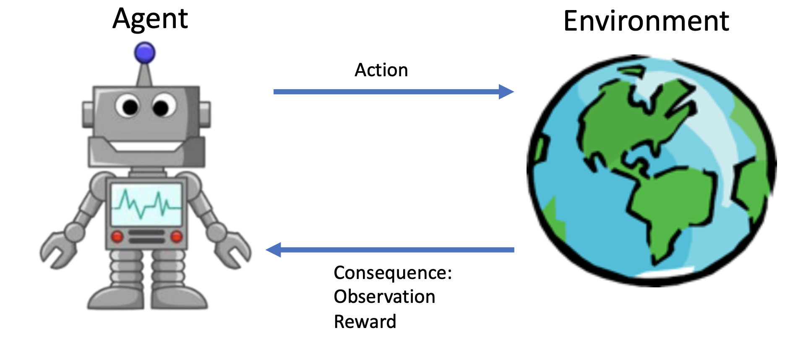
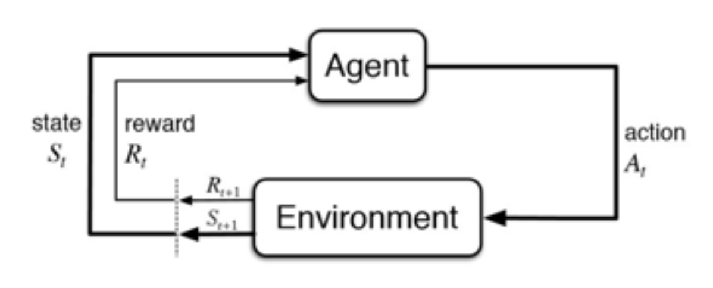
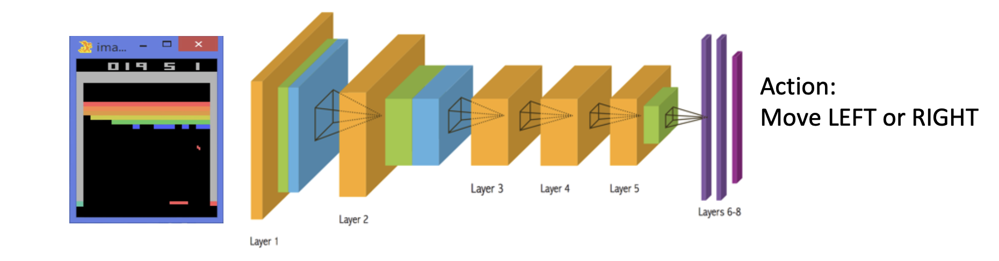
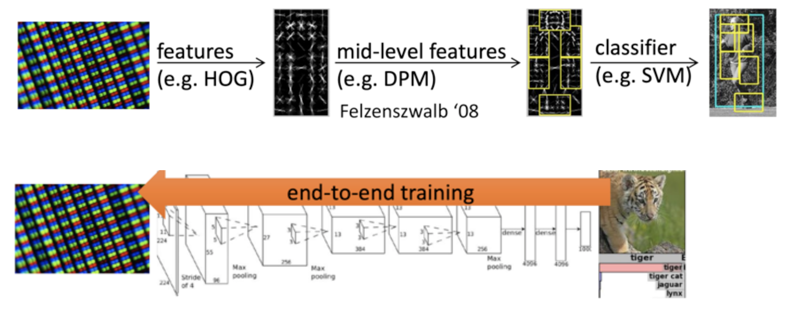
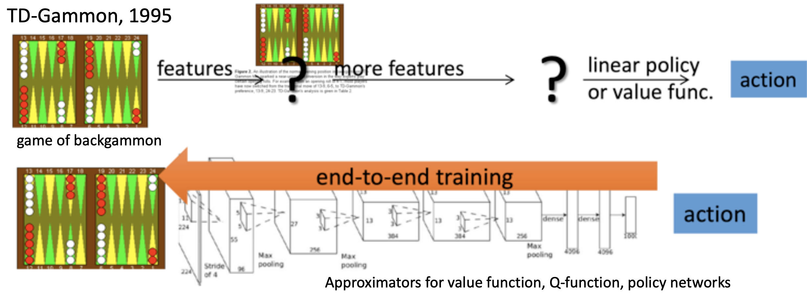

# 强化学习简介
## 什么是强化学习
所谓强化学习就是一个代理与一个未知的复杂环境进行不断的交互，在交互过程中最大化从环境中获得的累积奖励的过程。

## 强化学习中的序列决策

Agent不断地观察Environment，获取到环境当前的State，并根据State采取相应的Action影响Environment。
Environment受到影响后会到达一个新的State，并且返回给Agent一个Reward，告诉Agent上一步采取的Action是否足够有效。
Agent根据得到的Reward调整自己的行为方式，并观察Environment的新State继续采取对应的Action影响Environment。

## 强化学习的组成
除了序列决策过程中的action、state和reward外，强化学习一般都包括以下三个成分。
* Policy: agent 的action函数，不同state下应该采取什么action
* Value function: 对不同state（和action）好坏的衡量
* Model: Environment的state转移规律和reward产生规则

### Policy

policy是一个从state到action的映射函数，分为概率策略和决定性策略两种。
* Stochastic policy : $\pi(a|s) = P[A_t = a|S_t = s]$
* Deterministic policy: $a^* = arg\underset{a}{max} \ \pi(a|s)  $ 

### Value function
Value function是特定策略$\pi$下，未来Reward的总和的期望。特定state的Value function用$V_{\pi}(s)$表示，特定state下采用特定action后的Value function用$Q_{\pi}(s,a)$表示。

$V_{\pi}(s) = \mathbb{E}_{\pi}[G_t|S_t=s]=\mathbb{E}_{\pi}[\sum_{k=0}^{\infty} \gamma^k R_{t+k+1}|S_t=s]$

$Q_{\pi}(s,a) = \mathbb{E}_{\pi}[G_t|S_t=s, A_t = a]=\mathbb{E}_{\pi}[\sum_{k=0}^{\infty} \gamma^k R_{t+k+1}|S_t=s, A_t = a]$

其中$\gamma $是折扣因子，平衡直接reward和未来的reward之间的权重。

### Model
Model是对Environment行为的预测，预测会产生什么样的state和reward

$\mathcal{P}_{ss'}^a = \mathbb{P}[S_{t+1}=s'|S_t = s, A_t = a]$

$\mathcal{R}_{s}^a = \mathbb{P}[R_{t+1}=s'|S_t = s, A_t = a]$

## 强化学习 VS 监督学习
与传统的的监督学习相比，强化学习有很大的不同，主要体现在以下几点
* 强化学习的输入是时序相关的数据，而监督学习输入的数据是与时间无关的
* 监督学习输出的是预测出的label，强化学习输出的是agent需要采取的action。这action并不是用户提前定义的，而是学习得到的能够最大化累积reward的action
* 强化学习是没有监督的，只有一个reward来衡量学习的好坏，而reward的影响往往是滞后的

简单来说强化学习有以下几个特征
* Trial-and-error exploration
* Delayed reward
* Time matters
* Agent’s actions affect the subsequent data it receives

## 强化学习 VS 深度强化学习

在介绍深度强化学习之前，需要先介绍下traditional CV和deep CV。
* 传统的CV需要从像素图中不断提取出各类特征，然后利用提取出的特征，进行分类或者识别。
* deepCV通过训练一个统一的神经网络，同时实现特征的提取和特征的分类，这样可以同时对特征提取的参数和特征分类的参数进行优化。

deepRL 和 deepCV是类似的，将特征提取和动作决策都放在同一个神经网络中去学习，省去了手工定义特征的过程。

## 强化学习分类
根据action生成方式来分类可以分为三类
* Value-based：根据Value-function生成Policy
* Policy-based：直接生成Policy
* Actor-Critic:同时学习Value-function和Policy

根据是否学习环境模型可以分为两类
* model-based：对环境模型进行学习
* model-free： 直接对value-function和policy进行学习

## Exploration and Exploitation
* 探索:尝试新事物，可能使Agent在未来做出更好的决定
* 利用:根据过去的经验，选择能够产生最好reward的action

Agent必须探索足够多的state才能对环境有更好的认知，才能够更好地确定高收益的action。但如果进行太多的探索，就会减少高reward的利用，降低累积收益。所以探索-利用是相互矛盾的。为取得更高的累积Reward，Agent必须在探索和利用至今进行权衡。
  